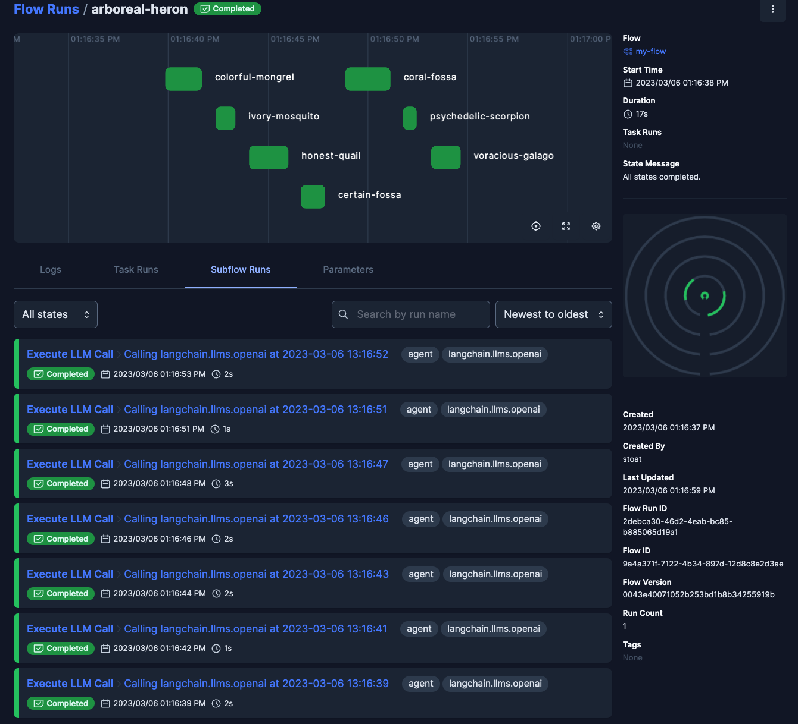

# prefect-langchain

<p align="center">
    <!--- Insert a cover image here -->
    <!--- <br> -->
    <a href="https://pypi.python.org/pypi/prefect-langchain/" alt="PyPI version">
        </a>
    <a href="https://github.com/zzstoatzz/prefect-langchain/" alt="Stars">
        </a>
    <a href="https://pypistats.org/packages/prefect-langchain/" alt="Downloads">
        </a>
    <a href="https://github.com/zzstoatzz/prefect-langchain/pulse" alt="Activity">
        </a>
    <br>
    <a href="https://prefect-community.slack.com" alt="Slack">
        </a>
    <a href="https://discourse.prefect.io/" alt="Discourse">
        </a>
</p>

Orchestrate and observe tools built with langchain using Prefect.


## Example Usage

### Call an LLM and track the invocation with Prefect:
```python
from langchain.llms import OpenAI
from prefect_langchain.plugins import RecordLLMCalls

with RecordLLMCalls():
    llm = OpenAI(temperature=0.9)
    text = (
        "What would be a good company name for a company that makes colorful socks?"
    )
    llm(text)
```
and a flow run will be created to track the invocation of the LLM:


### Run several LLM calls via langchain agent as Prefect subflows:
```python
from langchain.agents import initialize_agent, load_tools
from langchain.llms import OpenAI

from prefect import flow

llm = OpenAI(temperature=0)
tools = load_tools(["llm-math"], llm=llm)
agent = initialize_agent(
    tools, llm, agent="zero-shot-react-description", verbose=True
)

@flow
def my_flow():  # noqa: D103
    agent.run(
        "How old is the current Dalai Lama? "
        "What is his age divided by 2 (rounded to the nearest integer)?"
    )

with RecordLLMCalls():
    my_flow()
```


Find more examples [here](prefect_langchain/examples.py).

## Resources
### Installation

```bash
pip install prefect-langchain
```

Requires an installation of Python 3.10+.

### Feedback

If you encounter any bugs while using `prefect-langchain`, feel free to open an issue in the [prefect-langchain](https://github.com/zzstoatzz/prefect-langchain) repository.

If you have any questions or issues while using `prefect-langchain`, you can find help in either the [Prefect Discourse forum](https://discourse.prefect.io/) or the [Prefect Slack community](https://prefect.io/slack).

Feel free to star or watch [`prefect-langchain`](https://github.com/zzstoatzz/prefect-langchain) for updates too!

### Contributing

If you'd like to help contribute to fix an issue or add a feature to `prefect-langchain`, please [propose changes through a pull request from a fork of the repository](https://docs.github.com/en/pull-requests/collaborating-with-pull-requests/proposing-changes-to-your-work-with-pull-requests/creating-a-pull-request-from-a-fork).

Here are the steps:

1. [Fork the repository](https://docs.github.com/en/get-started/quickstart/fork-a-repo#forking-a-repository)
2. [Clone the forked repository](https://docs.github.com/en/get-started/quickstart/fork-a-repo#cloning-your-forked-repository)
3. Install the repository and its dependencies:
```
pip install -e ".[dev]"
```
4. Make desired changes
5. Add tests
6. Insert an entry to [CHANGELOG.md](https://github.com/zzstoatzz/prefect-langchain/blob/main/CHANGELOG.md)
7. Install `pre-commit` to perform quality checks prior to commit:
```
pre-commit install
```
8. `git commit`, `git push`, and create a pull request
